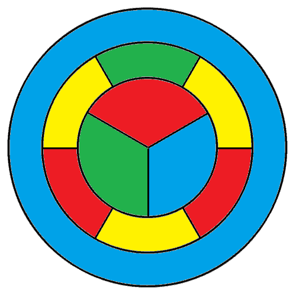

El teorema de los cuatro colores
===

Este repositorio contiene el código fuente de la presentación:

**Curso**: Introducción a la matemática discreta CM-254.

**Profesor**: MSc. Ronald Mas Huaman.

**Asesor**: MSc. Fidel Jara Huanca.

**Fecha**: 18 de junio del 2018.

**Aula**: R1 - 401.

## Integrantes del equipo:

* [Oromion](https://github.com/carlosal1015) Aznarán.
* Franss Cruz.
* José Navío.
* Gabriel Quiroz.

## Resumen

La presente presentación trata sobre la historia del teorema de los cuatro colores.

## Tabla de contenidos

1. Introducción
2. Acontecimientos importantes en la historia del teorema
3. Aplicaciones
4. Conclusiones

## Referencias

[1] Appel, Kenneth, and Wolfgang Haken. 1977. “The Solution of the Four-Color-Map Problem.” <em>Scientific American</em> 237 (4). Scientific American, a division of Nature America, Inc.: 108–21.

[2] Birkhoff, George D. 1913. “The Reducibility of Maps.” <em>American Journal of Mathematics</em> 35 (2). Johns Hopkins University Press: 115–28.

[3] Combinatorics, and Optimization University of Waterloo. 2017a. “SiGMa 2017 László Miklós Lovász, Extremal Graph Theory and Finite Forcibility.” <a href="https://www.youtube.com/watch?v=OfPf4qA1x_k" class="uri">https://www.youtube.com/watch?v=OfPf4qA1x_k</a>.

[4] “SiGMa 2017 Paul Seymour, Rainbow Induced Paths in Graphs with Large Chromatic and Small Clique Number.” <a href="https://www.youtube.com/watch?v=CnxmwDuYpX8" class="uri">https://www.youtube.com/watch?v=CnxmwDuYpX8</a>.

[5] Fritsch, Rudolf, and Gerda Fritsch. 1998. <em>The Four-Color Theorem: History, Topological Foundations, and Idea of Proof.</em> Springer.

[6] Kempe, Alfred Bray. 1879. “On the Geographical Problem of the Four Colours.” <em>American Journal of Mathematics</em> 2 (3). Johns Hopkins University Press: 193–200.

[7] Matoušek, Jiří, and Jaroslav Nešetřil. 2009. <em>Invitation to Discrete Mathematics</em>. Oxford University Press.

[8] Robertson, Neil, Daniel Sanders, Paul Seymour, and Robin Thomas. 1997. “The Four-Colour Theorem.” <em>Journal of Combinatorial Theory, Series B</em> 70 (1). Elsevier: 2–44.

[9] Thomas, Robin. 1995. “The Four Color Theorem.” <a href="http://people.math.gatech.edu/~thomas/FC/" class="uri">http://people.math.gatech.edu/~thomas/FC/</a>.

[10] Vilfred Kamalappan, V. 2017. “The Four Color Theorem: A New Proof by Induction.”

### Licencia

Licencia bajo [GPL V2](https://www.gnu.org/licenses/old-licenses/gpl-2.0.en.html)

Las diapositivas compiladas: [pdf](https://github.com/carlosal1015/4colores).